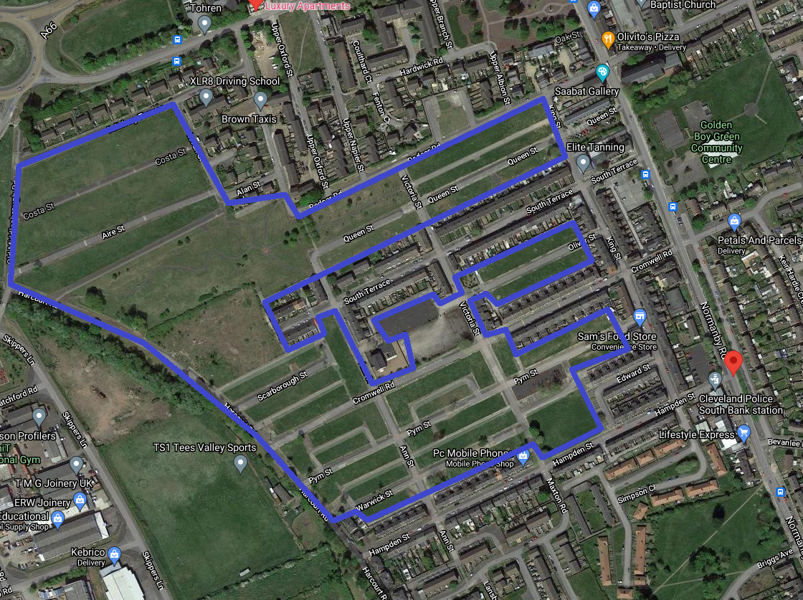
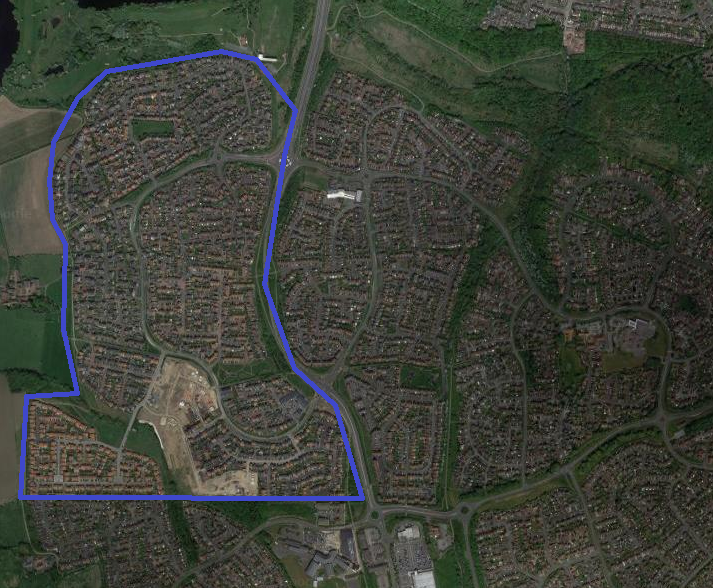

# Overview

A non-exhaustive walk through is provided for those wishing to apply spatial regression analysis in their work. These techniques can help understand geographical patterns of crime or public safety problems. This may be of most interest for analysts working in or closely with Community Safety Partnerships, Violence Reduction Units or in strategic roles where there are opportunities to inform changes in policies and crime prevention plans.

For a comprehensive accessible guide on approaches and theory I would highly recommend [Chainey, S. (2020). Understanding crime : analyzing the geography of crime. Redlands, California: Esri Press.](https://www.amazon.co.uk/Understanding-Crime-Analyzing-Geography/dp/158948584X), Chapter 8: Applying spatial regression analysis to crime data. Further resources are included at the end of this guide.


For this walk through I created an aggregated data set using Census Output Area (COA) areal units covering the Teesside Urban Area. The significant majority of COAs contain between 110-139 households. The data set includes:

* [police.uk](https://data.police.uk/data/) burglary data (excluding offences occurring within [Retail Centre Area boundaries](https://data.cdrc.ac.uk/dataset/retail-centre-boundaries). This is to create an approximate dataset for residential burglary). Please be mindful that this is a crude method that will create limitations when it comes to modelling the data.
* [Census 2011](https://www.nomisweb.co.uk/census/2011/quick_statistics) socio-demographic and household information - ethnicity, tenure, education, population structure
* [Consumer Vulnerability Classifications](https://data.cdrc.ac.uk/dataset/consumer-vulnerability)
* [Output Area Classifications](https://data.cdrc.ac.uk/dataset/output-area-classification-2011)
* [Indices of Multiple Deprivation 2019](https://www.gov.uk/government/statistics/english-indices-of-deprivation-2019)

When creating a data set it's a good idea to think about sourcing variables (or proxy variables) which are theoretically relevant and hypothesis driven - we could find many correlates with a large data set, but without theory might find it difficult to plausibly explain how the variable effects the outcome. Also consider whether or not the variable is something that could be modified in practice - the presence of heavy rain might explain lower burglary, but is not something that could be written into policy or a crime prevention plan. 


# Libraries and data

Libraries used as below.

```{r libraries, message=FALSE, warning=FALSE}

library(tidyverse)
library(sf)
library(sp)
library(tmap)
library(RColorBrewer)
library(GGally)
library(spdep)
library(spatialreg)
library(car)

```

Data import. This data set has been cleaned and checked for errors.

```{r import, message = FALSE, warning=FALSE, results = FALSE}

# import spatial data, geojson file
ts <- st_read("ts_burg_geojson.geojson")
# retrospectively added non-White data column
ts$bame <- ts$ea_mixed + ts$ea_black + ts$ea_asian

```

Data dictionary.

```{r datadic, echo=FALSE}

burg_labels <- read.csv("C:/Users/Iain Agar/Dropbox/teesside/burg_labels.csv")

rmarkdown::paged_table(burg_labels[,])

```

# Exploratory Data Analysis (EDA)

Let's begin by generating understanding of the data by exploring the trends and relationships among the variables. I used resources from the book [Geographical Data Science and Spatial Data Analysis, Lex Comber and Chris Brunsdon](https://study.sagepub.com/comber?_gl=1*1ulxctp*_ga*NTQwMjMwOTU0LjE2MjI4MjM3NTk.*_ga_60R758KFDG*MTYyNzk5NjU3MC4xMS4wLjE2Mjc5OTY1NzAuMA..*_ga_RK7MQ5ZZVZ*MTYyNzk5NjU3MC4xLjAuMTYyNzk5NjU3MC4w) to assist in this EDA.

## Correlation

The cor.test() function is a simple way to test the relationship between two variables, providing the Pearson's product moment correlation by default. A few examples are shown below observing the relationship between the Burglary Rate in 2019 and a) proportion of Asian households, b) proportion of student households and c) employment deprivation score.

The data outputs show the significance of the correlations (p-value), confidence intervals and the correlation coefficient estimates. These variables were all significantly correlated with burglary rates in 2019, with the effect size being greatest for employment deprivation.

```{r simplecorr, warning = FALSE, messages = FALSE}

# Burglary rate and % Asian Households
cor.test(~bdrate19 + ea_asian, data = ts)
# Burglary rate and % Student Households
cor.test(~bdrate19 + hh_student, data = ts)
# Burglary rate and Employment Deprivation
cor.test(~bdrate19 + imd_emp, data = ts)

```


Scatter plots are a visual alternative to viewing linear relationships. The example output below shows that there is a positive correlation or linear relationship between burglary rates and employment deprivation.

```{r scatter, warning = FALSE, messages = FALSE}

# call to ggplot
ggplot(data = ts, aes(x = bdrate19, y = imd_emp)) +
# add scatter plot, set opacity aesthetics  
  geom_point(alpha = 0.1) +
# add trend line method and aesthetics  
  geom_smooth(method = "lm", colour = "#DE2D26") +
# add labels
  labs(title = "Burglary Rate and Employment Deprivation: Teesside Output Areas 2019", x = "Burglary Rate", y = "Employment Deprivation") +
# choose theme  
  theme_bw()

```

Boxplots are useful when you want to view continuous and categorical data relationships. Using classification data we can view the distribution of burglary rates at COA level by consumer vulnerability groups and output area classifications.  

```{r boxplot, warning = FALSE, message = FALSE}

ts %>%
# call ggplot, order by output area classification  
  ggplot(aes(x = reorder(oac_gp, bdrate, FUN = median), y = bdrate, fill = "dodgerblue")) +
# add data to boxplot  
  geom_boxplot(aes(group = oac_gp), outlier.alpha = 0.4, outlier.colour = "grey25") +
# move x axis to vertical   
  coord_flip() + xlab("") + ylab("Burglary Rate") +
  labs(title = "Burglary Rate by Output Area Classification") +
  theme_minimal() +
# remove legend  
  theme(legend.position = "none")

# repeat above and change categorical variable to consumer vulnerability class
ts %>%
  ggplot(aes(x = reorder(gd_cv, bdrate, FUN = median), y = bdrate, fill = "dodgerblue")) +
  geom_boxplot(aes(group = gd_cv), outlier.alpha = 0.4, outlier.colour = "grey25") +
  coord_flip() + xlab("") + ylab("Burglary Rate") +
  labs(title = "Burglary Rate by Consumer Vulnerability Classification") +
  theme_minimal() +
  theme(legend.position = "none")
```

Seeing that the vulnerable communities group has higher rates of burglary, it might be useful to explore socio-economics and demographics to help identify potential hypotheses why? 

The radar plot below provides an overview of a selection of Census 2011 and IMD 2019 variables. We can see that the vulnerable communities group has much lower levels of owner occupied housing and educational attainment levels. There are also higher levels of income deprivation and employment deprivation. We might infer from this that communities with lower incomes and higher unemployment on average risk exhibiting higher rates of burglary. This might mean targeted interventions to secure households (assisted target hardening of properties) and reduce the skills/unemployment gap.

```{r radar, warning = FALSE, message = FALSE}

# create tibble from the spatial data ts
ts_tbl <- as_tibble(ts)

# create dataset for radar plot, select numeric variables to include
radar <- ts_tbl %>% select(19:24, 27, 34:37, 44, 49) %>%
# standardise the variables using scale  
  mutate_if(is.numeric, scale) %>%
# aggregate COA data to consumer vulnerability group  
  aggregate(by = list(ts$gd_cv), FUN = mean) %>%
# pivot   
  pivot_longer(-Group.1) %>%
# arrange by variable name for plotting  
  arrange(name) %>%
  filter(name != "gd_cv")

ggplot(data = radar, aes(x=factor(name), y=value, group = Group.1, colour = Group.1, fill = Group.1)) +
  geom_point(size = 2) +
  geom_polygon(size = 1, alpha = 0.2) +
  scale_color_manual(values = brewer.pal(6, "Set2")) +
  scale_fill_manual(values = brewer.pal(8, "Set2")) +
  facet_wrap(~Group.1, ncol = 3) +
  coord_polar() +
  theme_light() +
  theme(legend.position = "none", axis.title = element_blank(), axis.text = element_text(size = 6))

```

## Pairs

When working with problems that have many variables supported by theoretical frameworks, viewing them in one plot can provide a helpful overview. 

In the case of residential burglary there are many variables to consider including:

* Physical features and immediate surroundings of a property
* Socio-economic characteristics and household composition
* Household routine activities
* Crime specific considerations (proximity to acquisitive crime perpetrators, accessible markets for stolen items)
* Interaction of all the above

Unfortunately only limited information is available publicly for this walk through. 

The output below plots a selection of variables and their relationship to burglary rates. The results are split in two groups of COAs - higher or lower than the median rate. We can view the correlation coefficients, density plots, scatter plots, histograms and boxplots. 

```{r pairs, warning = FALSE, message = FALSE}

# select variables for pairing in correlation matrix
ts_tbl %>% .[c(12, 19:21,23:24,35, 37, 41, 49)] %>%
# add vector to indicate burglary rates around the median as Higher or Lower  
  mutate(bdrate_high = ifelse(bdrate19 > median(bdrate19), "H", "L")) %>%
# call ggpairs and set aesthetics for correlation coefficients and plots  
  ggpairs(aes(colour = bdrate_high, alpha = 0.4), 
          upper = list(continuous = wrap('cor', size = 2.5)),
          lower = list(continuous = wrap('points', alpha = 0.7, size = 0.1))) +
  theme(axis.line = element_blank(),
        axis.text = element_blank(),
        axis.ticks = element_blank())
``` 

## Spatial EDA

Viewing the variables using maps can be a heuristic approach to visualizing and making hypotheses about spatial relationships. 

The plot below shows the rates in burglary across Teesside COAs, this can be viewed as a static plot or as an interactive map. Somewhat limited, we can see that most geographical areas have lower rates of burglary and that areas with similar ranged values often cluster together geographically.

```{r tmapplot, warning = FALSE, message = FALSE}

# set to plot mode
tmap_mode("plot") 
# add polygon/shape file with data
tm_shape(ts) + 
# set variable attribute, title and style  
  tm_polygons("bdrate19", title = "Burglary Dwelling Per 1,000 2019", palette = "YlOrRd", style = "jenks", legend.hist = T) +
# customise layout  
  tm_layout(title = "Teesside Burglary by COA",
            frame = F, legend.outside = T,
            legend.hist.width = 1,
            legend.format = list(digits = 1),
            legend.outside.position = c("left", "top"),
            legend.text.size = 0.6,
            legend.title.size = 1) +
  tm_scale_bar(position = c("right", "bottom")) +
  tm_borders(col = "grey", lwd= 1)

```

Viewing and arranging spatial plots side-by-side becomes more useful. From this we can begin to see that areas with high rates of student households and Asian households appear to occupy the same COAs with high burglary rates (around the River Tees in Stockton and Middlesbrough central areas), but would be unlikely to explain high rates in Redcar and pockets in north of Stockton or south of Middlesbrough where there are few student or Asian households.

```{r plotsarranged, warning = FALSE, message = FALSE}

tmap_mode("plot") 

map1 <- tm_shape(ts) +
  tm_fill("bdrate19", palette = "Reds", style = "jenks", n = 5, title = "BD Rate '19") +
  tm_layout(legend.position = c("right", "bottom"), frame = F)

map2 <- tm_shape(ts) +
  tm_fill("hh_student", palette = "YlGn", style = "jenks", n = 5, title = "% Student HH") +
  tm_layout(legend.position = c("right", "bottom"), frame = F)

map3 <- tm_shape(ts) +
  tm_fill("ea_asian", palette = "YlOrRd", style = "jenks", n = 5, title = "% Asian HH") +
  tm_layout(legend.position = c("right", "bottom"), frame = F)

tmap_arrange(map2, map3, map1, nrow = 1)

```

Other pocket areas of high burglary rates would appear to co-locate with areas of high % social housing and high % of residents with no qualifications, in some instances but not all (i.e., Hemlington, to the south centre left part of Teesside).

```{r plotsarranged2, warning = FALSE, message = FALSE}

tmap_mode("plot") 

map1 <- tm_shape(ts) +
  tm_fill("bdrate19", palette = "Reds", style = "jenks", n = 5, title = "BD Rate '19") +
  tm_layout(legend.position = c("right", "bottom"), frame = F)

map4 <- tm_shape(ts) +
  tm_fill("ten_soc", palette = "YlGn", style = "jenks", n = 5, title = "% Social HH") +
  tm_layout(legend.position = c("right", "bottom"), frame = F)

map5 <- tm_shape(ts) +
  tm_fill("edu_noqual", palette = "YlOrRd", style = "jenks", n = 5, title = "% No Quals") +
  tm_layout(legend.position = c("right", "bottom"), frame = F)

tmap_arrange(map4, map5, map1, nrow = 1)

```

# Regression

Lets now attempt to create a regression to identify the relationship between multiple explanatory variables and a dependent variable (burglary rate). 

## Ordinary least squares (OLS)

Three OLS models have been produced and one Poisson GLM. 

* Model 1 uses Employment Deprivation, % Student Households, % Non-White, % Private Rented, % Owner Occupied and Living Environment score.

* Model 2 excludes the non-significant variable in Model 1 (% Student Households).

* Model 3 uses Model 1 variables but transforms the burglary rate to a logarithmic value.

* Model 4 uses Model 1 variables but changes dependent variable to burg19 count and uses a Poisson regression

The vif() function, Variation Inflation Factor, is used to check for multi-collinearity (where two or more explanatory variables are correlated). If explanatory variables have a vif > 7.5, it suggests the variable is redundant in the model and should be removed.

```{r ols, warning = FALSE, message = FALSE}

# run model 1
model1 <- lm(bdrate19 ~ imd_emp + hh_student + bame + edu_noqual + ten_priv + ten_own + imd_livenv, data = ts)
# summary of model outputs
summary(model1)
# variation inflation factor, to check for multi-collinearity
vif(model1)

# run model 2
model2 <- lm(bdrate19 ~ imd_emp + bame + edu_noqual + ten_priv + ten_own, data = ts)
summary(model2)
vif(model2)

# run model 3
model3 <- lm(log1p(bdrate19) ~ imd_emp + hh_student + bame + edu_noqual + ten_priv + ten_own, data = ts)
summary(model3)
vif(model3)

# run model 4 as Poisson 
model4 <- glm(burg19 ~ imd_emp + hh_student + bame + edu_noqual + ten_priv + ten_own + imd_livenv, family = "poisson", data = ts)
summary(model4)
vif(model4)

```

The results from the three linear models are weak. The output below shows the results for the three models side-by-side. Model 1 (27%) explains more of the variation in burglary rates than model 2 and 3. I'm ignoring model 4 for this walk through, this is included to show the call for producing a Poisson regression which may be used when data contains many units with zero counts creating a highly skewed data distribution.

```{r screenreg, warning = FALSE, message = FALSE}

texreg::screenreg(list(model1, model2, model3, model4))

# other statistics to consider
# AIC measure, the lower the AIC the better the model
AIC(model1)
AIC(model2)
# log likelihood measuring goodness of the fit, always negative, higher the ll (closer to zero) better the model
logLik(model1)
logLik(model2)

```

Mapping the residuals can help identify areas, and potentially other variables, that could help improve where the model is under performing. These are shown in the plot below.

```{r resids, warning = FALSE, message = FALSE}

# add residuals to ts data
ts$resids <- model1$residuals
# add standardised residuals
ts$s.resids <- as.vector(scale(ts$resids))

# add poisson resids
ts$poisresides <- as.vector(scale(model4$residuals))

# map resids
tmap_mode("view")
tm_shape(ts) +
  tm_fill("s.resids", palette = "seq", breaks = c(-Inf, -2, 0, 2, Inf), title = "Std. Resids", alpha = 0.6) +
  tm_layout(aes.palette = list(seq = "-RdBu")) +
  tm_shape(ts) +
  tm_borders(col = "black",lwd = 1)

```

A problem here is that we are using a proximate residential burglary data set. It is possible that the COAs with high/low standardised residuals are those where all burglary points falling within Retail Centre Areas were discarded.

The age of the Census data also presents problems. Some COAs have undergone extensive changes in number of households (urban clearance, urban development) which could have altered the socio-economic and population structures since 2011. Examples are shown below for two areas of Teesside.


```{r pic1, echo = FALSE, fig.cap="Urban Clearance of older properties in South Bank", out.width='100%'}



```

```{r pic2, echo = FALSE, fig.cap="New Urban Development in Ingleby Barwick", out.width = '100%'}



```

## Creating spatial weights

The data set is a shape file. We can use this to create spatial weights and neighbour relationships between COAs. A full guide on [Spatial regression analysis in R, Carlos Mendez](https://rpubs.com/quarcs-lab/tutorial-spatial-regression) is available here.

```{r sw, warning = FALSE, message = FALSE}

# create queen contiguity
queen.nb <- poly2nb(ts, row.names = ts$oa11cd)

# create rook contiguity
rook.nb <- poly2nb(ts, row.names = ts$oa11cd, queen = FALSE)

# summarise relationships
summary(queen.nb)

# test symmetry
is.symmetric.nb(queen.nb)

# create list
queen.listw <- nb2listw(queen.nb)
```

Check for spatial dependence using the Moran's I test. A Moran I statistic tells us if we have clustered values (closer to 1) or dispersed values (closer to -1), or no pattern (0). When the p-value is significant and the standard deviate is positive we can summarise that the spatial distribution is more spatially clustered than would be expected if spatial processes were random. 

There is spatial clustering in burglary rates by Teesside COAs. 


```{r sd, warning = FALSE, message = FALSE}
moranTest <- moran.test(ts$bdrate19, nb2listw(queen.nb))
moranTest
```

## Model selection

To identify which type of model to select we can examine model 1 using Local Moran tests.

The Moran Test for Model 1 indicates some clustering, with a positive SD and significant p value. 

The Lagrange Multiplier results suggest proceeding with a Spatial Lag model. A flow-chart for interpreting the results and selecting a model is provided [here, see Figure 2](https://www.mdpi.com/2071-1050/12/4/1638/htm).

```{r modelselection, warning = FALSE, message = FALSE}

# test the spatial dependency of the model
lmMoranTest <- lm.morantest(model1, queen.listw)
lmMoranTest

# calculate lagrange multiplier diagnostics
lmLMtests <- lm.LMtests(model1, queen.listw, test = c("LMerr", "LMlag", "RLMerr", "RLMlag", "SARMA"))
lmLMtests

```
## Spatial Lag Model

The call for a Spatial Lag model using the spatial weights list is provided below with a summary. The Spatial Lag model R square is only marginally better than the OLS model 1 (0.2827 versus 0.2675). It is likely if we were to include information on past burglary rates that this would improve significantly as crime hot spots tend not to change quickly over time.

```{r slag, warning = FALSE, message = FALSE}

# spatial lag model include spatial weights
model5 <- lmSLX(bdrate19 ~ imd_emp + hh_student + bame + edu_noqual + ten_priv + ten_own + imd_livenv, data = ts, queen.listw) 
summary(model5)

```


# Summary

Appreciated this walk through is a whistle stop tour!  Intended audience are those working as crime, community safety or violence reduction unit analysts and who are interested in developing skills in spatial analysis, statistics and working with R. 

Other more advanced techniques that you may wish to consider when working with spatial data are GWR (Geographic Weighted Regression), Machine Learning (i.e., Random Forests, Gradient Boosting Machines, k-nearest neighbours) and Risk Terrain Modeling.

# Learn more

Amazing resources below.

* [GeoDa](https://geodacenter.github.io/), an open source software tool for geo-spatial data techniques
* [Geographical Data Science, Lex Comber and Chris Brunsdon](https://www.amazon.co.uk/Geographical-Data-Science-Spatial-Analysis/dp/1526449366/ref=sr_1_1?dchild=1&keywords=geographical+data+science&qid=1628020280&s=books&sr=1-1)
* [MGWR Multiscale Geographically Weighted Regression](https://sgsup.asu.edu/sparc/multiscale-gwr), an open source software tool for performing GWR 
* [Spatial regression analysis in R, Carlos Mendez](https://rpubs.com/quarcs-lab/tutorial-spatial-regression)
* [Understanding Crime: Analyzing the Geography of Crime, Spencer Chainey](https://www.amazon.co.uk/Understanding-Crime-Analyzing-Geography/dp/158948584X)

